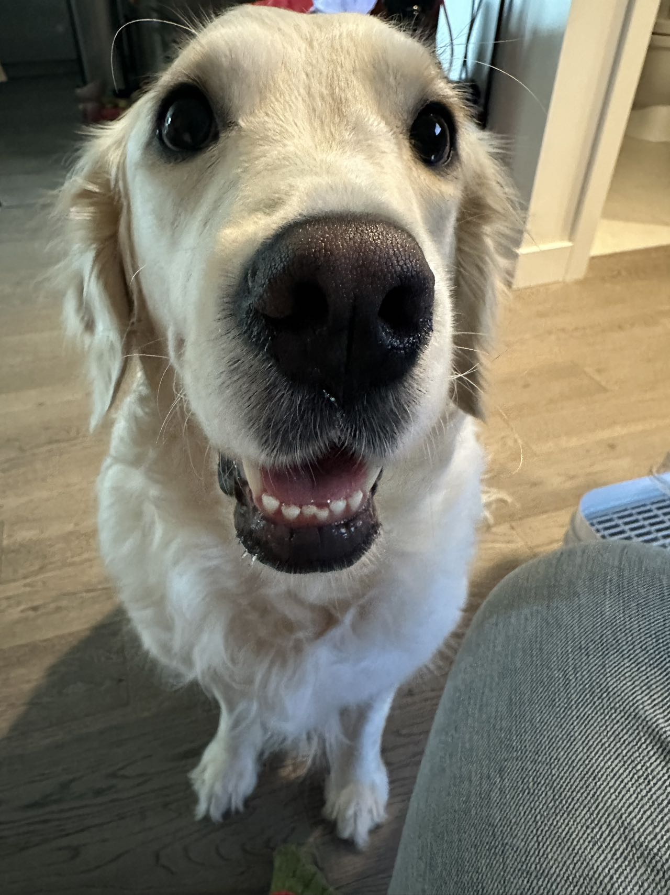

# CS 5500 Fall 2024 Template Repository 
- This is the landing page of your team.
- **Team Name:** Puppylover
- **Team Logo:** Our logo represents the essence of Puppylover with a clean and minimalist design, featuring a playful dog silhouette and paw prints to symbolize our team's shared love for dogs. The warm tones and friendly curves reflect our collaborative spirit and enthusiasm for approaching challenges with energy and curiosity.
- **Team Description:** We are the Puppylover team, united by our shared passion for dogs. Our team of four brings together a diverse set of skills, and we aim to approach each challenge with the same enthusiasm and teamwork that we admire in our furry friends. Just like puppies, we are energetic, curious, and always ready to learn and grow!
## Project Description

The BC Cancer Foundation aims to enhance donor engagement through a streamlined Donor Engagement Optimization System. This project addresses the challenges in managing event invite lists by facilitating collaboration among event organizers/fundraisers and coordinators. details of the project can be found in the [README.md](Project/README.md) file.

The web application is organized within the `donor-engagement-system` folder, which contains three main components:

1. **Backend**: The backend is built using TypeScript and Node.js, utilizing the Express framework to handle API requests. It manages donor data, events, and fundraising activities, providing a robust API for the frontend to interact with. The backend also includes a MySQL database for data storage.

2. **SQL**: The SQL scripts are included to set up the database schema and seed initial data. These scripts define the structure of the database tables and relationships, ensuring that the application has the necessary data to function correctly.

3. **Frontend**: The frontend is developed using React and Material-UI, providing a user-friendly interface for interacting with the donor engagement system. It allows users to view events, manage donors, and collaborate on fundraising efforts.

### Getting Started

To get started with the project, follow these steps:

1. **Clone the Repository**:
   ```bash
   git clone https://github.com/William-g7/BC-Cancer-Event-Management-System.git
   cd donor-engagement-system
   ```

2. **Backend Setup**:
   - Navigate to the backend directory and install the necessary dependencies.
   - Set up your environment variables as described in the backend README.

3. **Database Setup**:
   - Run the SQL scripts provided in the `sql` directory to create the necessary tables and seed data.

4. **Frontend Setup**:
   - Navigate to the frontend directory and install the required packages.
   - Start the frontend application to interact with the backend APIs.

## Team Members
| Image | Name | Email |
|-------|------|-------|
|  | William | gao.xing4@northeastern.edu |
|  | Makoya | lin.zhenz@northeastern.edu |
|  | Shiyuan | chen.shiyua@northeastern.edu |
|  | Yan | wang.yan8@northeastern.edu |

## Assigned TA

| Image | Name | Email |
|-------|------|-------|
|  | Bella | xie.xinyu@northeastern.edu |


## Weekly Stand-Up Time
- 10:30 am, every Friday.

