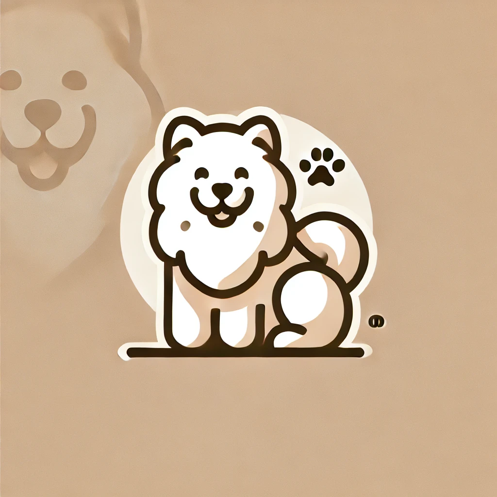

# CS 5500 Fall 2024 Template Repository 

- This is the landing page of your team.
- **Team Name:** Puppylover
- **Team Logo:** Our logo represents the essence of Puppylover with a clean and minimalist design, featuring a playful dog silhouette and paw prints to symbolize our team's shared love for dogs. The warm tones and friendly curves reflect our collaborative spirit and enthusiasm for approaching challenges with energy and curiosity.
- **Team Description:** We are the Puppylover team, united by our shared passion for dogs. Our team of four brings together a diverse set of skills, and we aim to approach each challenge with the same enthusiasm and teamwork that we admire in our furry friends. Just like puppies, we are energetic, curious, and always ready to learn and grow!

## Team Members
| Image | Name | Email |
|-------|------|-------|
|  | William | gao.xing4@northeastern.edu |
|  | Makoya | lin.zhenz@northeastern.edu |
|  | Shiyuan | hippo@example.com |
|  | Yan | wang.yan8@northeastern.edu |

## Assigned TA
Your TA will be one of these:

| Image | Name | Email |
|-------|------|-------|
|  | Bella | xie.xinyu@northeastern.edu |
|  | Edward | Zhang.jiale2@northeastern.edu |

## Weekly Stand-Up Time
- [Place holder for the assigned time for the weekly stand up with TA]

